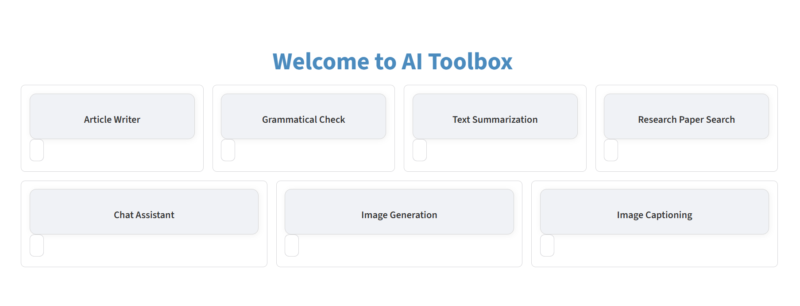

# AI Toolbox

AI Toolbox is a collection of lightweight AI applications built with Streamlit.  
The project focuses on practical AI use cases such as text generation, summarization, grammar correction, retrieval-augmented question answering, and research paper exploration.

## Features

### Article Writer
Generates structured and SEO-friendly articles from a user-provided topic.  
Uses a decoder-only transformer language model (Mistral) for long-form text generation.  
Prompt design and decoding parameters are used to control structure, length, and coherence.

### Grammar Checker
Performs sentence-level grammatical correction on input text.  
Uses a sequence-to-sequence transformer based on the T5 architecture.  
Grammar correction is formulated as a text-to-text rewriting task while preserving meaning.

### Text Summarization
Summarizes long documents into concise and coherent outputs.  
Uses an encoder-decoder transformer model based on the BART architecture.  
The model performs abstractive summarization with length-controlled decoding.

### Research Paper Search
Searches research papers from arXiv based on a user query.  
Uses a sentence-level transformer model based on the Sentence-BERT architecture.  
Text is converted into dense semantic embeddings using a MiniLM backbone, and cosine similarity is used to rank papers by relevance.

### Chat Assistant (RAG)
Provides Wikipedia-based question answering using a retrieval-augmented generation pipeline.  
Uses a sentence-transformer model based on MiniLM for semantic retrieval and a decoder-only transformer model (Mistral) for answer generation.  
Relevant Wikipedia passages are retrieved and injected into the generation prompt to produce grounded and context-aware responses.

### Image Captioning
Generates natural language captions for uploaded images.  
Uses a vision-language transformer model based on the BLIP architecture.  
A visual encoder extracts image features, and a text decoder generates descriptive captions.

### Text to Image Generation
Generates images from user-provided text prompts.  
Uses a latent diffusion model conditioned on transformer-based text embeddings.  
Text prompts guide the iterative denoising process in latent space, and this feature requires GPU acceleration for practical inference.

## Tech Stack

- Frontend: Streamlit  
- Language Models: Hugging Face Transformers  
- Embeddings: sentence-transformers  
- Vector Search: FAISS  
- NLP Utilities: NLTK, scikit-learn  
- Data Sources: Wikipedia, arXiv API  

## Model Usage and Attribution

This project uses pretrained models from Hugging Face.  
No models were trained from scratch as part of this work.  
All models are used strictly for inference and follow their respective licenses and usage terms.

## Disclaimer

This project is intended for educational, research, and demonstration purposes.  
The author does not claim ownership of the models used in this application.

